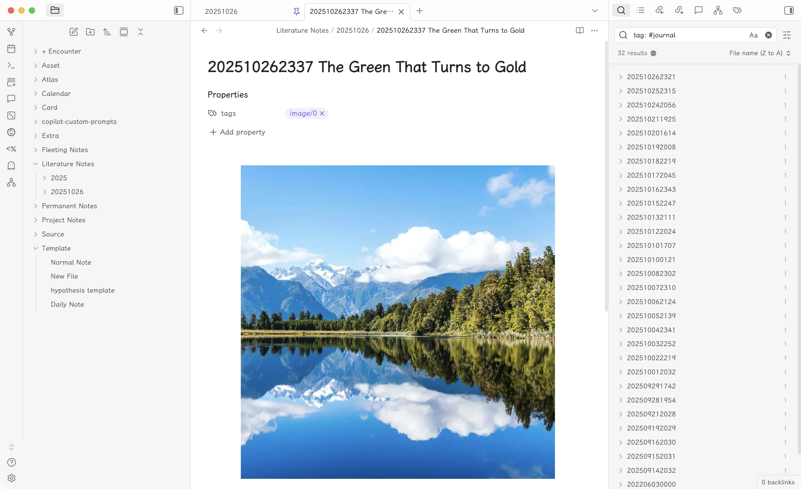

# Quietus



A minimalist and elegant Obsidian theme focused on clean typography and smooth interactions.

## Features

-   🎨 **Clean Visual Design**: Minimalist interface with accent color customization
-   📝 **Enhanced Typography**: Uniform header sizes with prefix indicators (H1-H6)
-   🖼️ **Smart Image Handling**: Auto-centered images with smooth hover effects and max-height control
-   🔗 **Stylish Links**: Internal links with arrow prefix and highlight on hover
-   ☑️ **Custom Checkboxes**: Clean checkbox design with custom check marks
-   📜 **Smooth Scrollbars**: Minimal, unobtrusive scrollbar styling
-   🌓 **Dark & Light Mode**: Full support for both themes

## Installation

### From Obsidian

1. Open **Settings** in Obsidian
2. Navigate to **Appearance** → **Themes**
3. Click **Manage** and search for "Quietus"
4. Click **Install and use**

### Manual Installation

1. Download `theme.css` from this repository
2. Copy the file to your vault's `.obsidian/themes/` folder
3. Reload themes in Obsidian settings
4. Select "Quietus" from the theme dropdown

## Customization

You can customize the accent color by modifying the CSS variable in your `theme.css`:

```css
body {
	--accent-color: #8a5cf5; /* Change this to your preferred color */
}
```

## Screenshots

See the preview image above for the theme's appearance.

## Support

If you encounter any issues or have suggestions, please [open an issue](https://github.com/yuanzhixiang/obsidian-theme-quietus/issues) on GitHub.

## Author

Created by [yuanzhixiang](https://yuanzhixiang.com)

## License

MIT License
